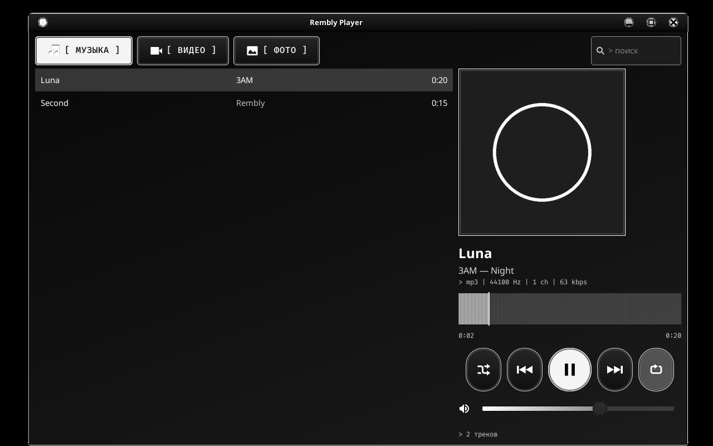
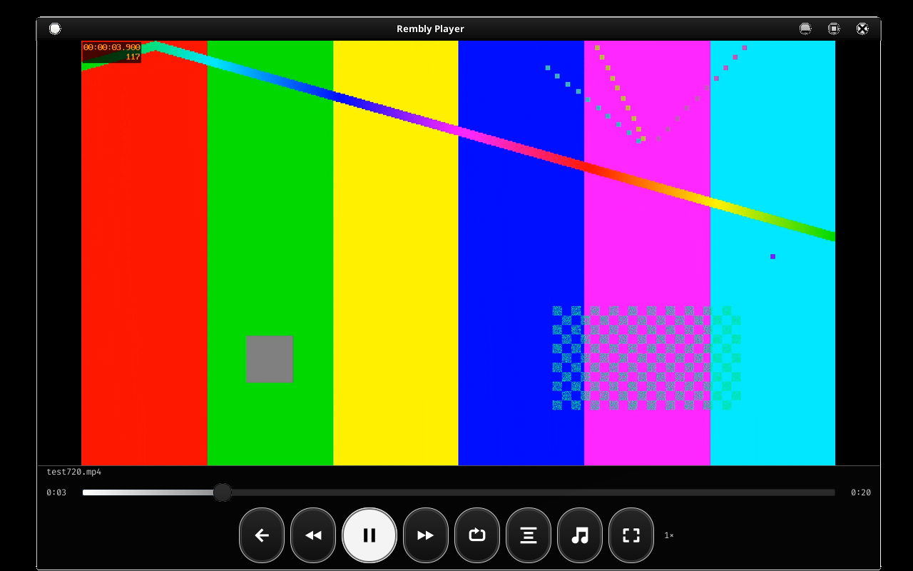
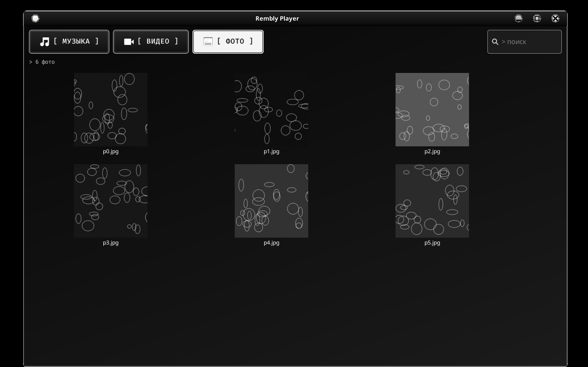
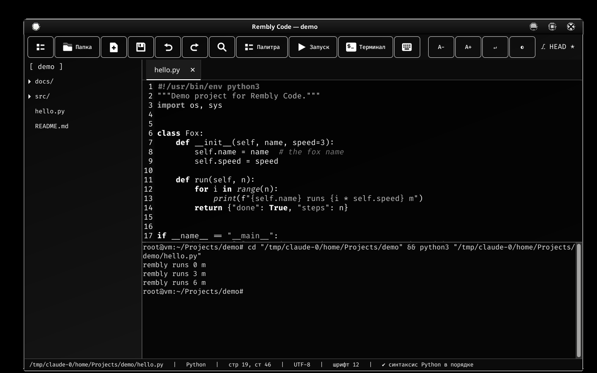
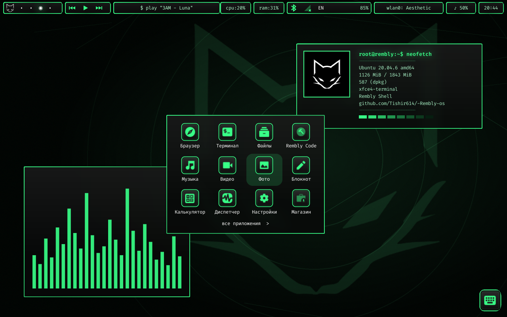
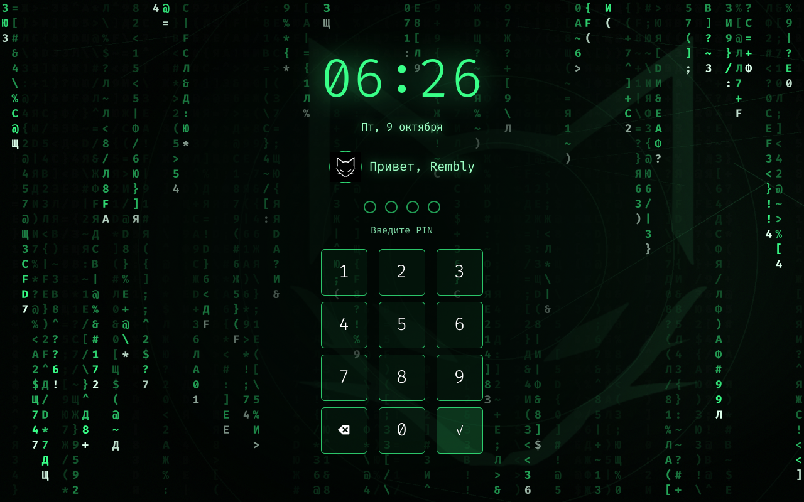

# Rembly OS — руководство

## Первый запуск
1. Включите планшет, `fastboot boot out/A73-linux-test.img` (см. README-A73.md). Появится заставка Rembly OS.
2. При первом входе откроется мастер «Добро пожаловать»: имя, город для погоды, часовой пояс (вкладка «Время и язык»).
3. Пароль root: `rembly` (смените в Настройки → Разработка).

## Рабочий стол
| Элемент | Что делает |
|---|---|
| Левое меню | Главная, Приложения (все), Файлы, Терминал, Интернет, категории Разработка/Графика/Мультимедиа/Игры/Система, Настройки, Выключение |
| Сетка «Приложения» | быстрые приложения; лупа открывает полный лаунчер с поиском |
| «Проекты» | папки из `~/Projects`, «+» создаёт новую |
| Виджеты | погода (wttr.in), «Сейчас играет» (playerctl: кнопки ⏮ ⏯ ⏭), CPU/RAM/диск, быстрые заметки (открывают экранную клавиатуру) |
| Док (внизу по центру) | аватар = показать рабочий стол, избранные приложения, **«Окна»** = переключатель открытых программ с кнопкой «Закрыть», клавиатура |
| Слева внизу | 4 рабочих стола |
| Справа внизу | Wi-Fi, Bluetooth, SIM, батарея+часы = **Быстрые настройки** |

## Быстрые настройки (нажмите на батарею/часы)
Яркость, громкость, Wi-Fi/Bluetooth/SIM, экранная клавиатура, скриншот (папка `~/Pictures`), «Не беспокоить»,
режим экономии, поворот экрана (по кругу), блокировка, настройки, **Отчёт** (диагностика), выключение.

## Кнопка питания и экран
Короткое нажатие — погасить/включить экран (с блокировкой, если включена), долгое (>1,2 с) — меню выключения.
Через 60 с без касаний экран тускнеет, через 120 с гаснет (не гаснет, пока играет музыка/видео через MPRIS).
Время и PIN настраиваются в «Экран и питание». Низкий заряд: предупреждения на 15% и 5%, на 2% безопасное выключение.

## Настройки Rembly
Профиль · Экран и питание (яркость, ориентация, размер интерфейса, обои, таймеры, PIN) · Звук · Сеть ·
Время и язык (часовой пояс, NTP, раскладки EN/RU/TR; Alt+Shift) · Производительность (память, zram, режим CPU) ·
Разработка (SSH, пароль root, Git) · О планшете (отчёт, обновление).

## Магазин приложений
`rembly-store`: курируемые приложения по категориям, поиск по всему Ubuntu 20.04 armhf, установка/удаление
одним нажатием (нужен интернет). Тяжёлые программы помечены «⚠ тяжёлое».

## Консольные команды
`rembly-net status|wifi-scan|wifi-connect SSID PSK|bt-up|modem-probe`, `rembly-rotate cw|ccw|ud|none`,
`rembly-eco on|off|toggle`, `rembly-lock [--set PIN]`, `rembly-report`, `rembly-update DIR|URL`,
`rembly-restart-shell`.

## Если что-то не работает
1. `rembly-report` (или кнопка «Отчёт») создаёт `/root/rembly-report-*.tgz`: `adb pull` его и пришлите.
2. Экран перевёрнут/сенсор не туда: Настройки → Экран → Ориентация или `rembly-rotate ccw`.
3. Нет экрана, но есть adb: `adb shell`, затем `cat /var/log/rembly-x.log`.
4. Обновить скрипты без пересборки образа: положите свежий репозиторий на флешку и `rembly-update /путь/к/репозиторию`.

## Управление только пальцем (без мыши и клавиатуры)
* **Экранная клавиатура (Onboard)** появляется сама, когда вы нажимаете на поле ввода (пароль Wi-Fi, поиск, заметки, настройки).
  Она «прижата» к нижнему краю, окна приложений уменьшаются над ней. Вручную: кнопка клавиатуры в доке или в быстрых настройках.
  В терминале и некоторых программах автопоказа нет: нажмите кнопку клавиатуры в доке.
* **Окна** сами раскрываются на весь экран (нет мелких окон, которые трудно тянуть пальцем). Переключение — кнопка «Окна» в доке.
* **Wi-Fi**: значок в трее или Быстрые настройки → Wi-Fi: крупный список сетей, нажатие на сеть → вверху окно пароля («глаз» показывает пароль),
  клавиатура внизу. Сохранённые сети подключаются одним нажатием, кнопка «Забыть» удаляет.
* Прокрутка — перетаскиванием пальца; курсор мыши скрывается; все кнопки крупные (≥ 44 px).
* Если сенсор «не туда»: Настройки → Экран → Ориентация (или `rembly-rotate ccw`).

## Жесты и сенсор (вместо мыши)
| Жест | Действие |
|---|---|
| Касание | клик |
| Долгое нажатие (~0,65 с на месте) | **правый клик** (контекстное меню) — демон `rembly-touchd` |
| Свайп от **верхнего** края вниз | быстрые настройки |
| Свайп от **левого** края вправо | все приложения |
| Свайп от **правого** края влево | переключатель окон |
| Перетаскивание пальцем | прокрутка/перемещение |
| Кнопка ⌨ на правом краю экрана | экранная клавиатура (для терминала и программ без автопоказа) |

Настройка жестов: `/etc/rembly/touch.conf` (`LONGPRESS`, `EDGES`, `SCROLL2=1` включает прокрутку двумя пальцами, `LP_MS`, `EDGE_PX`).
Демон только читает сенсор и **не перехватывает** его: если он упадёт, обычные касания продолжат работать.
Проверка и калибровка направления: **Настройки → Экран → Проверка сенсора** (4 мишени и след пальца; кнопка «Повернуть», если точка смещена).
Команды интерфейсу можно слать и вручную: `echo quick|launcher|switcher|power|home|keyboard > /run/rembly/ctl`.

## Внешний вид иконок
Иконки приложений — современные цветные «стеклянные» плитки (цвет плитки подбирается под значок). Переключатель: Настройки → Экран → Стиль иконок.
Логотип и аватар (лисичка) — из вашего изображения (`assets/logo-original.png`): заставка загрузки, экран блокировки, «О планшете», аватар в меню и доке.

## Плавность
Оболочка не опрашивает систему внешними программами: расположение окон, рабочий стол, простой, музыка (MPRIS по D-Bus), Wi-Fi читаются
в самом процессе. Замер на хосте (одинаковые условия, 30 с простоя): **1,66 % → 0,20 % ядра** (≈ в 8 раз меньше), память оболочки ≈ 100 МБ.
Дополнительно: нет композитора и анимаций, zram-swap, `earlyoom`, автоматический режим экономии при заряде ≤ 20 %.

## «Живой» рабочий стол и защита от зависаний
Мерцающие звёзды, падающая звезда раз в 20–40 с, плавное появление панелей при входе, «прыжок» значка в доке при запуске, приветствие по времени суток
и погодная иконка по состоянию неба. Это дёшево: перерисовываются только крошечные прямоугольники, а анимации **сами выключаются**, когда:
рабочий стол закрыт окнами (ноль затрат), включён режим экономии/низкий заряд, высокая нагрузка процессора, или интерфейс начинает отставать.
Настройки → Экран → «Анимации рабочего стола»: полные / экономные / выключены.
Подробно про Linux-программы: `docs/LINUX-APPS.md`.

## Установка, таймер и очистка
* **Установить на планшет:** Настройки → Установка на планшет (или шаг 2 в мастере первого запуска). Подробно и про fastboot-прошивку: `docs/INSTALL.md`.
* **Таймер** (в «Приложениях»): таймер с пресетами, секундомер с кругами, будильник; сигнал приходит уведомлением (и звуком, если появится ALSA-карта).
* **Освободить место:** Настройки → Производительность → «Освободить место» (`rembly-clean`: кэши apt, временные файлы, миниатюры, старые логи; ваши файлы не трогает).

## Драйверы Wi-Fi — автоматически
Ничего скачивать не надо: система сама берёт файлы Wi-Fi из раздела Android на планшете (только чтение). Первый запуск → через минуту-две Wi-Fi готов,
значок в трее. Если нет: Настройки → Сеть → «Найти и установить драйверы Wi-Fi автоматически». Подробно: `docs/NETWORK.md`.

## Если Wi-Fi не заработал
Настройки → Сеть → «Диагностика Wi-Fi: найти причину и починить», затем Настройки → О планшете → «Проверка системы». Дальше — `rembly-report` и пришлите архив. Подробно: `docs/TROUBLESHOOTING.md`.

## Обновление одной командой (0.9)
`rembly-update` — проверяет версию, скачивает новую, **проверяет синтаксис новых файлов до установки**, делает копию заменяемых файлов
(`/var/backups/rembly`, хранятся 5 последних), ставит и перезапускает оболочку. `--check` только проверяет, `--system` ещё и обновляет пакеты Ubuntu,
`--rollback` возвращает прошлую версию. Ваши настройки (`/etc/rembly/*.conf`, `ai.conf`, PIN, часовой пояс, `~/.config`) не перезаписываются.
Источник — `/etc/rembly/update.conf`. Раз в сутки при наличии сети планшет сам только проверяет наличие новой версии и присылает уведомление; сам ничего не ставит.
Файлы не подписаны: защита — HTTPS к репозиторию владельца, проверка синтаксиса и откат. Обновление ядра/загрузочного образа не делается (это только через ПК и fastboot).

## Что нового в интерфейсе и настройке (0.10)
- **Автонастройка:** при первом включении `rembly-autosetup` сама создаёт папки, локали (русский/английский), уникальное имя, кэши, достаёт драйверы из разделов Android,
  поднимает сеть, делает самопроверку и, когда появится Wi-Fi, скачивает обновление. Каждый шаг запоминается; если сети нет, шаг повторится позже.
- **Раскладка RU/EN:** кнопка «EN/RU» в правой части нижней панели переключает язык одним касанием (также Alt+Shift, Win+Пробел, плитка «Язык» в быстрых настройках). Экранная клавиатура берёт текущую раскладку системы.
- **Обновление:** плитка «Обновление» в быстрых настройках или Настройки → Обновить. Окно показывает, что нового, качает и ставит сама, есть «Откатить».
  Источник и ветка — `/etc/rembly/update.conf` (для приватного репозитория впишите `TOKEN=`).
- **Оптимизация:** плитка «Оптимизация» — чистит кэши/логи, пересобирает кэши иконок и Python, делает TRIM; раз в неделю в простое запускается сама.

## Как на ПК (0.11)
- **Флешки и OTG-диски** подключаются сами (`/media/<метка>`, FAT/exFAT/NTFS/ext4), безопасное извлечение: `rembly-eject`. Работает, если в стоковом ядре есть драйвер USB-накопителей и нужной ФС — на планшете не проверено.
- **Диспетчер задач** (`rembly-taskman`): ЦП/память по программам, «Закрыть», «Принудительно», защита системных процессов.
- **Проверка перед прошивкой** (`tools/verify-images.sh`, вызывается из `flash-rembly.sh` сама): ядро и DTB байт-в-байт как в вашем `boot.bin`, адрес/страница как у стока, размер < 16 МиБ, ext4 с меткой REMBLY, `e2fsck`, sparse == raw, нужные файлы внутри образа. Любое «FAIL» — ничего не отправляется на планшет. `--skip-verify` отключает (не рекомендуется).

## Забота о планшете (0.14)
- **Защита от перегрева** (`rembly-thermal`): каждые 15 с смотрит самую горячую зону; при 80 °C включает экономию и присылает уведомление, при 90 °C ещё и приглушает экран; ниже 70 °C возвращает ваш профиль и яркость. Журнал: `/var/log/rembly-thermal.log`. Ничего не выключает.
- **Профили питания** (`rembly-profile eco|balanced|performance|next`): плитка «Профиль» в быстрых настройках и кнопки в Настройки → Производительность. Профиль запоминается. Режим выбирается из губернаторов, которые реально есть в ядре планшета.
- **Хранилище** (`rembly-storage`): сколько занимают система, пакеты, ваши файлы, кэш, журналы; самые большие папки; кнопка безопасной очистки.
- Плитка «Диспетчер» в быстрых настройках открывает диспетчер задач.

## Строгая автонастройка под ваш планшет (0.17)
- `rembly-hwprobe` **измеряет** планшет, а не угадывает по названию: SoC, ядро, ОЗУ, видимое разрешение панели (не удвоенный размер буфера), подсветка, режимы CPU, датчики температуры, батарея, тач (имя и диапазон). Сравнивает с профилем A73 и выдаёт вердикт `match` / `partial` / `unknown`.
- Из измерений выводятся настройки, **каждая с проверкой допустимого диапазона** (вне диапазона — не применяется, остаётся значение по умолчанию): размер zram и `/tmp` по ОЗУ, `min_free_kbytes`, DPI по ширине панели и физическому размеру (если не задан вручную: «Настройки → Экран → Размер интерфейса → Авто»), подсветка, режим CPU. Выполняется при каждой загрузке (`rc.d/04-device.sh`), результат — `/etc/rembly/device.conf`.
- `rembly-autosetup` после каждого шага **проверяет результат по реальной системе**: PASS (подтверждено), FAIL (не прошла проверка; 3 попытки на следующих загрузках), WAIT (нужна сеть), WARN (сделано, но планшет отличается от профиля). Шаги: device, dirs, locale, hostname, caches, touch, drivers, net, selftest, update. Итоговый отчёт: `rembly-autosetup status` (и в `rembly-report`); «всё проверено» пишется только если подтверждены все шаги. `rembly-autosetup --retry` — начать заново.
- Профиль A73 — это то, что известно из стокового ядра и `boot.bin`; физический размер панели (217×136 мм) — допущение, поэтому DPI можно поменять вручную.

## Настоящая оперативная память (0.20)
Fastboot/загрузчик сообщает о себе то, что записано в нём, а не то, что есть физически, поэтому **ОС ничему из этого не верит**:
- при каждой загрузке `rembly-hwprobe` берёт объём из измерений: `MemTotal` (доступно системе) и физическую память по `/proc/iomem`, узлу `memory` дерева устройств и строке `Memory: …K/…K` в журнале загрузки ядра; по ним считаются zram, `/tmp`, `min_free_kbytes` (`/etc/rembly/device.conf`: `RAM_MB`, `RAM_PHYS_MB`);
- `rembly-ramtest` проверяет память **тестом**: в каждую страницу пишется уникальное значение, затем всё читается обратно (несуществующая память проявляется как наложение страниц или порча данных), плюс проверка залипших бит. По умолчанию ~128 МБ свободной памяти (секунды), `--full` — до 70% свободной. `--claim 2048` сравнивает с названной вам цифрой (магазин, упаковка, fastboot);
- первая автонастройка делает этот тест (шаг `ram`), результат — в `rembly-autosetup status`, в самопроверке и в `rembly-report`.
- Скрипт прошивки с ПК (`tools/flash-rembly.sh`) сохраняет всё, что загрузчик «заявляет» (`fastboot getvar all`), в `out/fastboot-claims-*.txt` и показывает его «память» с пометкой «не проверено» — чтобы после загрузки сравнить с измеренным.
Ограничение: тест проверяет свободную память (не всю: занятое ядром и системой не трогается) и не заменяет полноценный memtest с загрузчика.

## Недостающие файлы находятся и докачиваются сами (0.21)
Если после первой прошивки что-то не доехало или удалилось, при **каждом входе в систему** `rembly-repair auto` быстро (без сети, секунды) сверяет систему со списком «как выглядит полная установка» (`/usr/share/rembly/MANIFEST.sha256` и `packages.txt`, создаются при сборке образа и обновляются `rembly-update`). Если всё на месте, ничего не показывается. Если нет — приходит уведомление, программа ждёт сеть (до 30 минут) и сама восстанавливает:
- **файлы Rembly** (программы, библиотеки, темы, правила, ярлыки) — копируются из репозитория (`/etc/rembly/update.conf`); каждый файл сначала проходит проверку синтаксиса, брать можно и с флешки: `rembly-repair fix --from /media/ФЛЕШКА/копия-репозитория`;
- **пакеты Ubuntu** — через `rembly-pkg` (с проверкой места), группами по 8, чтобы один неизвестный пакет не блокировал остальные;
- **драйверы Wi-Fi/BT** — через `rembly-drivers` (разделы планшета, флешка, ваша проверенная ссылка).
Команды: `rembly-repair check` (показать), `fix` (починить), `fix --all` (вернуть и изменённые вручную файлы Rembly). Журнал: `/var/log/rembly-repair.log`, строка в самопроверке и в `rembly-report`.
Не чинит: ядро и загрузочный образ (они прошиваются с ПК) и разделы Android. Файлы, которых нет в репозитории (например, если вы удалили их из своей ветки), восстановить нельзя — об этом будет сказано.

## Первый запуск: докачка того, что не доехало (0.22)
При первом старте после прошивки (`rc.d/07-firstrepair.sh` → `rembly-repair firstboot`, фоном, с низким приоритетом) делается **глубокая проверка**: файлы Rembly по хэшам (недостающие *и* повреждённые — при первом старте правок пользователя ещё нет, поэтому отличающийся файл считается повреждённым) и **каждый файл каждого пакета Ubuntu** через `dpkg -V`. Затем программа ждёт сеть (до 30 минут; подключите Wi-Fi значком в трее), докачивает файлы из репозитория, переустанавливает пакеты с повреждёнными файлами и снова проверяет. Пока проверка не пройдена, повтор при следующих запусках (до 6 раз). Результат — в `rembly-autosetup status` (шаг `files`) и `/var/log/rembly-repair.log`.

## Плеер: музыка, видео, фото (0.28)

Плитки «Музыка», «Видео», «Фото» на рабочем столе открывают **Rembly Player** на нужной вкладке (`rembly-player --tab music|video|image`). Файлы ищутся в `~/Music`, `~/Videos`, `~/Pictures`, `~/Downloads` и на каждом подключённом накопителе (`/media/*`). Музыкальные, видео- и графические файлы в Файлах по умолчанию тоже открываются в плеере (`mimeapps.list`).
- **Музыка**: нажмите трек — играет очередь из списка. Полоса перемотки — это волна трека (её считает mpv в фоне с низким приоритетом, до ~25 минут записи); пока волны нет, показывается обычная полоса. Кнопки: вперемешку, назад (в первые 4 с — к предыдущему, потом — в начало), пауза, вперёд, повтор (выкл / всё / один). Из терминала: `playerctl play-pause|next|previous` — плеер отвечает по MPRIS, кнопки на верхней панели работают так же.
- **Видео** : касание видео показывает/прячет панель в полном экране; **двойное касание слева — назад на 10 с, справа — вперёд на 10 с, в центре — пауза**; плеер запоминает место остановки (для файлов дольше 2 минут) и продолжает с него. Кнопки: скорость (1× → 1,25× → 1,5× → 2× → 0,75×), субтитры, звуковая дорожка, полный экран. Горячие клавиши: пробел, ←/→, F, Esc.
- **Фото** : сетка эскизов, листание свайпом влево/вправо, щипок или двойное касание — увеличение, перетаскивание при увеличении, кнопки «−/по размеру/+», поворот, слайдшоу (смена кадра каждые 4 с). Эскизы кэшируются в `~/.cache/rembly/thumbs` (до ~60 МБ).

Чего ждать от железа (честно): планшет декодирует видео **программно**. Комфортно — примерно H.264 до 720p; 1080p и тяжёлые кодеки (HEVC, 10 бит) будут пропускать кадры. Плеер сам замечает пропуски и пишет предупреждение вверху. Звук идёт через ALSA: если в `aplay -l` нет звуковой карты (драйвера звука для этого ядра я не проверял), видео пойдёт без звука, а плеер так и скажет. Жесты щипка зависят от мультитача сенсора mtk-tpd (не проверено) — кнопки «+/−» работают в любом случае.

## Rembly Code: лёгкий «VS Code» (0.28)

Настоящий VS Code — это Electron (целый Chromium); на 2 ГБ памяти без GPU и с ядром 3.18 он тяжёлый и **не проверен** на этом планшете. Поэтому в систему встроен **Rembly Code** (`rembly-code`) — тот же рабочий процесс, но на GTK, стартует за секунду и не лагает на больших файлах:
- проводник (кнопка слева, Ctrl+B), вкладки, нумерация строк, подсветка синтаксиса (Python, C/C++, JS, shell, HTML, Markdown, JSON и ещё десятки языков), автоотступ, поиск и замена (Ctrl+F), **палитра Ctrl+P** (быстро открыть файл проекта или выполнить команду, `>` — только команды);
- **встроенный терминал** (Ctrl+`) и запуск файла по **F5** (Python, JS, shell, C/C++, Go, Ruby, Perl, Lua, PHP); после сохранения `.py` — проверка синтаксиса в строке состояния; ветка git и отметка изменений вверху справа;
- экономия: файлы больше 1,5 МБ открываются без подсветки (больше 30 МБ — не открываются, для них есть `less`/`vim`), история отмен ограничена, в фоне ничего не работает кроме проверки git раз в 10 с;
- схемы цвета: чёрно-белая и «матрица» (кнопка ◐), шрифт Fira Code, A−/A+, перенос строк, автосохранение; в портретной ориентации панель сокращается, проводник прячется.

**Настоящий VS Code по желанию:** `rembly-install-vscode --check` покажет, потянет ли ваш планшет (ОЗУ, место, ядро, подкачка); `rembly-install-vscode` скачает официальный пакет для 32-битного ARM с update.code.visualstudio.com, **проверит SHA-256**, поставит его через apt и создаст запуск `code-rembly` с флагами для планшета без GPU (`--no-sandbox --disable-gpu …`) и настройками без тяжёлых функций (карта кода, цветные скобки, плавная прокрутка, телеметрия, автообновления, слежение за большими папками). Удаление: `rembly-install-vscode --remove`. Предупреждение: ядро 3.18 старее, чем требует Electron; если окно не откроется, это не ошибка установки — используйте Rembly Code.

## Стиль «Хакер» (0.28)

Настройки → Экран и питание → **Стиль оформления** (или `rembly-style hacker` / `rembly-style mono`). Ничего не скачивается.
- Зелёный люминофор на чёрном: приложения Rembly (моноширинный шрифт, квадратные рамки, свечение), значки-плитки, **рамки окон** (отдельная тема xfwm4 «Rembly-Hacker»), обои, GTK-приложения (Файлы, Geany…), уведомления.
- **Терминал**: зелёная палитра и приглашение в стиле Kali (`┌──(root@rembly)-[~/Projects]` / `└─#`) с коротким баннером REMBLY OS при открытии (отключается `REMBLY_NOBANNER=1`).
- **Рабочий стол**: подписи панели в виде `cpu:20%`, `$ play "…"`, карточка `root@rembly:~$ neofetch█` с мигающим курсором (мигает только пока рабочий стол виден).
- **Цифровой дождь**:  на экране блокировки (под часами тёмная подложка, чтобы текст читался) и приложение **Матрица** (`rembly-matrix`, касание — выход). Один новый символ на столбец за кадр, ≈8 кадров/с, останавливается при высокой нагрузке или экономии заряда.
- Окна, открытые до смены стиля, меняют вид после перезапуска (рабочий стол и панель перезапускаются сами). Экранная клавиатура Onboard остаётся в своей теме.
- Ограничения: стиль проверен на экране ПК (Xvfb), реальный планшет я не видел; нагрузка дождя на Cortex-A53 оценена по времени кадра на ПК (≈1 мс, на A53 ожидаю порядка 10 мс), а не измерена на устройстве.

